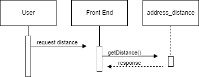

# Address Distance

A Django microservice that calculates the distance between two addresses.

# Installation

1. Recommended to use a virtual environment
2. pip install -r requirements.txt
3. [API Key Setup](https://developers.google.com/maps/documentation/distance-matrix/get-api-key)
4. Add API key to address_distance/api/config.py
5. Start using `python manage.py runserver`

# Usage

Default use:
    
    [POST REQUEST]
    
    http://localhost:8000/api/distance/

Request data:

    {
        origin: [street][city][state][zip/postal code]
        destination: [address2]
    }

    EXAMPLE:

    {
        origin: 300 NW 3rd St, Corvallis, OR 97330
        destination: SW Campus Way, Corvallis, OR 97331
    }

Response data:
    
    {
        "destination_addresses": [
            "SW Campus Way, Corvallis, OR 97331, USA"
        ],
        "origin_addresses": [
            "300 NW 3rd St, Corvallis, OR 97330, USA"
        ],
        "rows": [
            {
                "elements": [
                    {
                        "distance": {
                            "text": "2.4 km",
                            "value": 2401
                        },
                        "duration": {
                            "text": "7 mins",
                            "value": 432
                        },
                        "status": "OK",
                        "distance_mi": {
                            "text": "3.86 mi"
                        }
                    }
                ]
            }
        ],
        "status": "OK"
    }

# UML Sequence Diagram

# License

